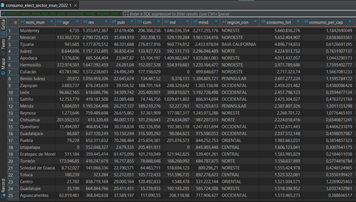
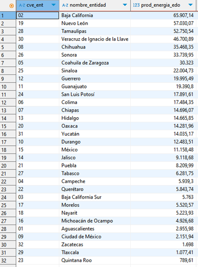
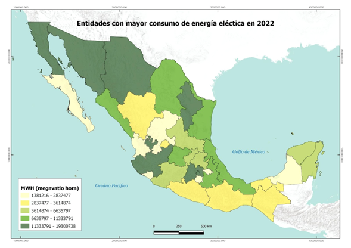

## Objetivo 3
 
## Describir la aportación de energía renovable al consumo total de energía eléctrica anualmente a nivel estatal.

### 1. ¿Cuál es su capacidad de generación por fuente renovable?

``` sql
CREATE TABLE resultados.prod_energia_renovable AS
SELECT pe.energet_pr,
SUM(pe.gener_gwh) AS prod_energia
FROM public.plantas_generadoras_tecnologia pe
WHERE pe.energet_pr IN ('Sol', 'Viento', 'Bagazo de caña', 'Agua', 'Calor Geotermico')
GROUP BY pe.energet_pr
ORDER BY prod_energia desc;
```
### 2.¿Cuál es la capacidad de generación de energía eléctrica renovable en GWh por estado?
   ``` sql
CREATE TABLE resultados.prod_energia_renovable AS
SELECT
e.cve_ent,
e.nomgeo AS nombre_entidad,
SUM(pe.gener_gwh) AS prod_energia_edo, e.geom
FROM public.entidades e
JOIN public.plantas_generadoras_tecnologia pe
ON ST_Intersects(pe.geom, e.geom)
WHERE pe.energet_pr IN ('Sol', 'Viento', 'Bagazo de caña', 'Agua', 'Calor Geotermico')
GROUP BY e.cve_ent, e.nomgeo, e.geom
ORDER BY prod_energia_edo DESC;
```

### 3. ¿Cuál es la capacidad de generación de energía eléctrica no renovable en GWh por estado?
``` sql
CREATE TABLE resultados.prod_energia_no_renovable AS
SELECT
   e.cve_ent,
   e.nomgeo AS nombre_entidad,
   SUM(pe.gener_gwh) AS prod_energia_edo,
   e.geom
FROM public.entidades e
JOIN   public.plantas_generadoras_tecnologia pe
 ON ST_Intersects(pe.geom, e.geom)
WHERE pe.energet_pr NOT IN ('Sol', 'Viento', 'Bagazo de caña', 'Agua', 'Calor Geotermico')
GROUP BY e.cve_ent, e.nomgeo, e.geom
ORDER BY prod_energia_edo DESC;
```
### 4. ¿Cuál es la mayor fuente de energía renovable que se produce por región CENACE?
   ``` sql
CREATE TABLE resultados.regio_energia_general AS
SELECT region_con, pe.energet_pr,
      SUM(pe.gener_gwh) AS prod_energia
FROM public.plantas_generadoras_tecnologia pe
WHERE pe.energet_pr IN ('Sol', 'Viento', 'Bagazo de caña', 'Agua', 'Calor Geotermico')
GROUP BY region_con, pe.energet_pr
ORDER BY region_con, prod_energia DESC;
```


<p align="center">
  
</p>


<p align="center">
  
  
</p>
